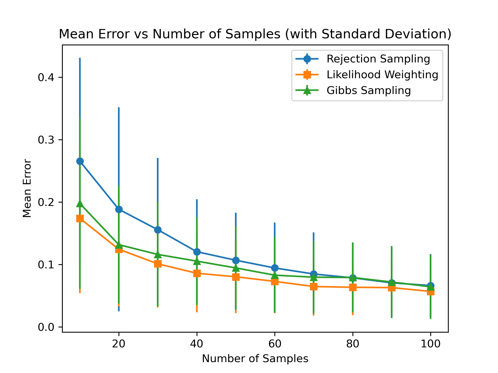

# BayesNet Inference & Sampling

This project implements various sampling techniques for Bayesian Networks, including Prior Sampling, Rejection Sampling, Likelihood Weighting, and Gibbs Sampling. It also includes comparison experiments between these techniques.

## File Structure

- `main.py` : The main script for running the experiments.
- `weather.json` : Example data file representing a Bayesian network.
-  `error_vs_samples.png` : Output plot generated from the experiments.

## Requirements

- `python >= 3.9`

## Usage

Navigate to the project directory and run the following command:

```bash
python ./main.py
```

The script will print the results of the sampling experiments in the terminal. Additionally, figures showing the comparison of errors vs. sample sizes will appear in a separate window.

Output figures will be automatically saved in the current directory after the script finishes running.

## Results

The program outputs:

1. The estimated probabilities for the query node using different sampling techniques.
2. A plot comparing the mean error vs. the number of samples for Rejection Sampling, Likelihood Weighting, and Gibbs Sampling.

The plot is saved as `error_vs_samples.png` in the project folder and is displayed after the experiments are run. Multiple figures might be generated, and you'll need to close each one before the next appears.

